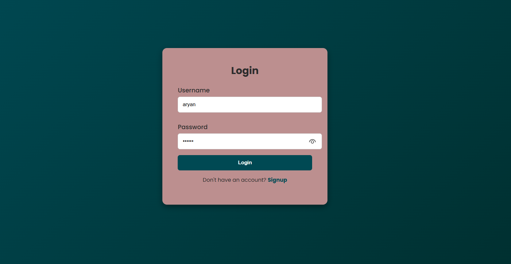
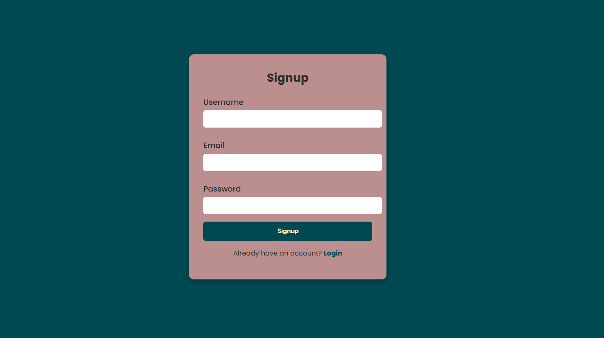
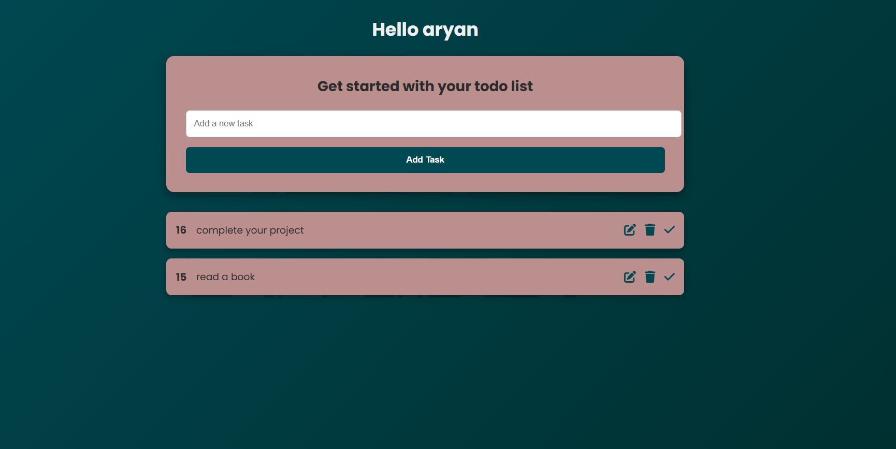

# Django Todo App

A simple todo app built with **Django**, **HTML**, and **CSS**.

---

## ✨ Features
- Add, edit, and delete tasks
- Mark tasks as complete
- Responsive UI for desktop and mobile

---

## 📸 Screenshots

### Login


### Signup


### Todo List


### Edit Task


---

## ⚙️ Installation

1. Clone the repository:
   ```bash
   git clone https://github.com/yourusername/todo.git
   cd todo